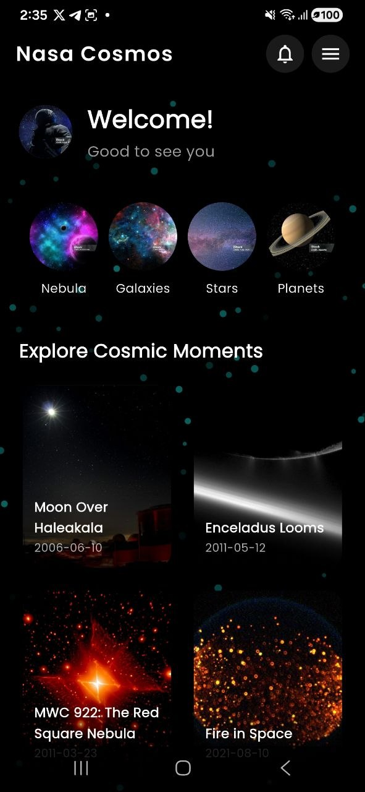
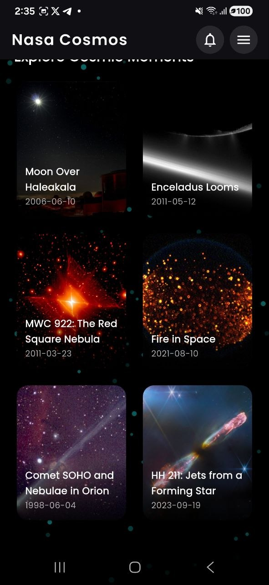
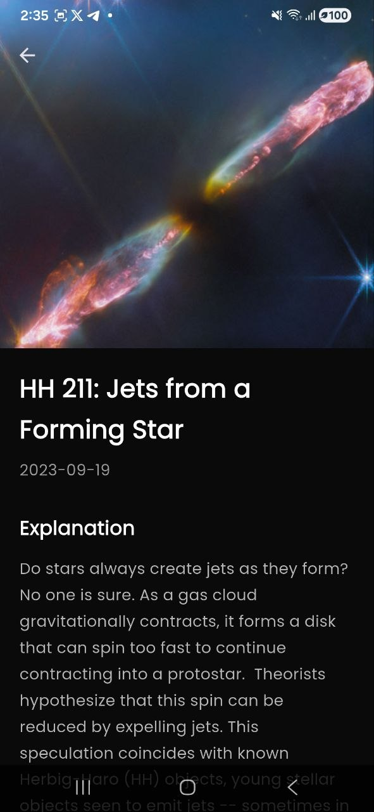

# NASA Cosmos

A stunning Flutter mobile app that brings **NASA's Astronomy Picture of the Day (APOD)** to your phone with a space-themed UI/UX.


## Features

- Real-time NASA Astronomy Picture of the Day
- Browse multiple stunning space images
- Smooth animations and immersive detail view
- Pull to refresh
- Modern dark space UI with particle effects
- Clean architecture with proper state management


## Tech Stack

- **Flutter** + Dart
- NASA Open API
- `http`, `cached_network_image`, `flutter_animate`, `google_fonts`
- `animated_background` for particle effects


## Screenshots

<p align="center">
  
  
  
</p>


## How to Run

1. Clone the repo
   ```bash
   git clone https://github.com/Pomiyilma/Nasa-Cosmos.git